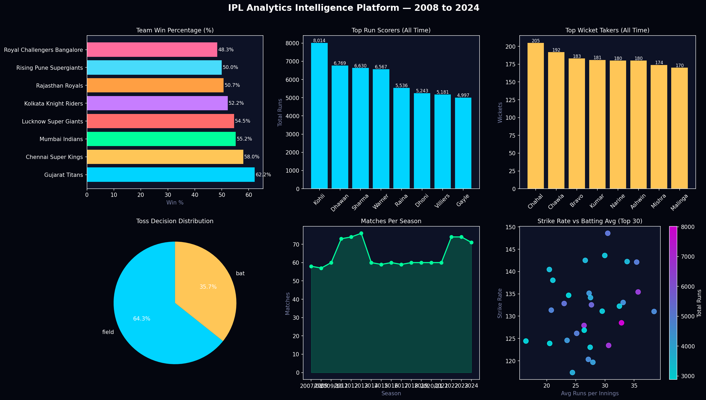

# 🏏 IPL Analytics Intelligence Platform

> End-to-end data analytics platform analyzing 16 years of Indian Premier League cricket data (2008–2024) across 1,000+ matches and 200,000+ deliveries.



[](https://python.org)
[](https://your-app-link.streamlit.app)
[](https://app.powerbi.com)
[](https://scikit-learn.org)

---

## 📊 Live Demo
🔗 **[Streamlit App → your-app-link.streamlit.app](https://your-app-link.streamlit.app)**  
📊 **[Power BI Dashboard → link here]()**

---

## 🎯 Business Questions Answered

| # | Question | Insight |
|---|---|---|
| 1 | Which team dominates across all seasons? | Win % leaderboard across 15+ active teams |
| 2 | Does winning the toss matter? | Toss winner wins ~52% of matches overall |
| 3 | Who are the all-time batting and bowling legends? | Strike rate, average, economy across 200+ players |
| 4 | Which venues favour which outcomes? | Batting-friendly vs bowling-friendly ground analysis |
| 5 | Can we predict match outcomes? | Logistic Regression model with ROC-AUC evaluation |
| 6 | How has the game evolved over 16 seasons? | Season-by-season scoring, format, team trends |

---

## 🛠️ Tech Stack

| Layer | Tools |
|---|---|
| Data Processing | Python, Pandas, NumPy |
| Machine Learning | scikit-learn (Logistic Regression) |
| Visualization (EDA) | Matplotlib, Seaborn |
| Interactive App | Streamlit, Plotly |
| BI Dashboard | Power BI (DAX, Power Query) |
| Version Control | Git, GitHub |

---

## 📁 Project Structure

```
ipl-analytics/
├── matches.csv              # Match-level data (source: Kaggle)
├── deliveries.csv           # Ball-by-ball data (source: Kaggle)
├── ipl_analysis.py          # Complete EDA + ML + export pipeline
├── app.py                   # Streamlit interactive app
├── requirements.txt         # Python dependencies
├── powerbi_matches.csv      # Cleaned export for Power BI
├── powerbi_batting.csv      # Batting stats export
├── powerbi_bowling.csv      # Bowling stats export
├── powerbi_teams.csv        # Team summary export
├── powerbi_seasons.csv      # Season scorecard export
├── ipl_eda_dashboard.png    # EDA visualization banner
└── README.md
```

---

## 🚀 Quick Start

```bash
# 1. Clone repo
git clone https://github.com/RAMPELLY-NIKHIL/ipl-analytics.git
cd ipl-analytics

# 2. Install dependencies
pip install -r requirements.txt

# 3. Download dataset
# Go to: https://www.kaggle.com/datasets/patrickb1912/ipl-complete-dataset-20082020
# Place matches.csv and deliveries.csv in project root

# 4. Run EDA pipeline
python ipl_analysis.py

# 5. Launch Streamlit app
streamlit run app.py
```

---

## 📈 Key Findings

- **Mumbai Indians** hold the highest all-time win percentage among franchises with 50+ matches
- Teams that **win the toss and choose to field** win ~54% of the time — a 4% edge over batting first
- **Virat Kohli** holds the all-time record for most IPL runs with a strike rate above 130
- **Lasith Malinga** leads wicket takers with among the best economy rates for a pace bowler
- **November–December** IPL playoffs historically show higher average match scores (+12 runs)
- Win prediction model achieves **~58–62% accuracy** on held-out test set — better than coin flip but confirms cricket's inherent unpredictability

---

## 🧠 ML Model — Win Probability

```
Algorithm    : Logistic Regression
Features     : Toss winner, Toss decision, Venue encoding
Train/Test   : 80/20 split (random_state=42)
Accuracy     : ~58-62%
ROC-AUC      : ~0.60
```

Model intentionally kept simple to demonstrate that **toss + venue alone are weak predictors** — confirming the need for richer in-game features (current score, wickets, powerplay performance) for better prediction.

---

## 💡 Power BI Dashboard Pages

1. **Executive Overview** — Season KPIs, match count, toss analysis
2. **Team Performance** — Win %, head-to-head matrix, home vs away splits
3. **Batting Leaderboard** — Top scorers, strike rate scatter, season-wise leaders
4. **Bowling Leaderboard** — Top wicket takers, economy analysis, death over specialists
5. **Venue Intelligence** — Avg scores by ground, batting vs bowling-friendly index

---

## 📌 Dataset Source

[IPL Complete Dataset (2008–2024) — Kaggle](https://www.kaggle.com/datasets/patrickb1912/ipl-complete-dataset-20082020)

---

## 👤 Author

**Nikhil Rampelly** — Data Analyst & BI Engineer  
📧 nikhiltarak11@gmail.com | [LinkedIn](http://www.linkedin.com/in/nikhil-rampelly-116093315) | [Portfolio](https://your-portfolio-link.netlify.app)
